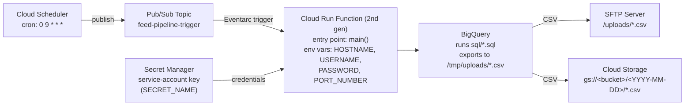

# BigQuery-to-SFTP Pipeline (Cloud Run Functions + BigQuery + SFTP)

A serverless, event-driven ETL pipeline on GCP. Once a day it pulls data
out of BigQuery, lands it as CSV, ships it to an SFTP server, and
archives a copy in Cloud Storage.

This project is intentionally small in scope (one Cloud Run function, one
Pub/Sub topic, one Cloud Scheduler job) so it's easy to read end-to-end,
while still exercising a realistic combination of GCP services: Cloud
Scheduler, Pub/Sub, Eventarc, Cloud Run Functions, BigQuery, Secret
Manager, and Cloud Storage.

## Architecture



**Flow:** Cloud Scheduler publishes a message to a Pub/Sub topic every
day at 09:00 → the topic's Eventarc trigger invokes the Cloud Run
function → the function fetches GCP credentials from Secret Manager →
runs every `.sql` file in `sql/` against BigQuery → writes the results to
`/tmp/uploads/*.csv` → uploads those files to the SFTP server and to a
Cloud Storage bucket.

## Project structure

```
.
├── main.py             # Pipeline logic + Cloud Run function entry point (`main`)
├── configurations.py   # GCP project/bucket/secret identifiers (fill in before use)
├── requirements.txt    # Runtime Python dependencies
└── sql/
    └── example.sql      # Example extraction query (BigQuery public dataset)
```

Every `.sql` file dropped into `sql/` is automatically picked up, run
against BigQuery, and exported as `<filename>.csv`, then uploaded to both
the SFTP server and Cloud Storage - no code changes needed to extract an
additional dataset, just add another `.sql` file.

## Prerequisites

- A GCP project with billing enabled
- [`gcloud`](https://cloud.google.com/sdk/docs/install) CLI, authenticated: `gcloud auth login`
- [`uv`](https://docs.astral.sh/uv/) for Python dependency management: `curl -LsSf https://astral.sh/uv/install.sh | sh`
- Access to an SFTP server to push the feed files to (credentials for testing)
- The following APIs enabled on the project:
  ```bash
  gcloud services enable \
    run.googleapis.com \
    cloudfunctions.googleapis.com \
    eventarc.googleapis.com \
    pubsub.googleapis.com \
    cloudscheduler.googleapis.com \
    secretmanager.googleapis.com \
    bigquery.googleapis.com \
    storage.googleapis.com \
    cloudbuild.googleapis.com
  ```

## Setup

1. Clone the repo and create a virtual environment with `uv`:

   ```bash
   uv venv
   source .venv/bin/activate
   uv pip install -r requirements.txt
   ```

2. Fill in `configurations.py`:

   ```python
   PROJECT_ID = "your-gcp-project-id"
   GCS_BUCKET_NAME = "your-archive-bucket"
   SECRET_NAME = "your-secret-name"
   SECRET_VERSION = "latest"
   ```

3. Create the Cloud Storage archive bucket:

   ```bash
   gcloud storage buckets create gs://<GCS_BUCKET_NAME> \
     --project=<PROJECT_ID> --location=<region>
   ```

4. Create a service account for the pipeline and store its key in Secret Manager:

   ```bash
   gcloud iam service-accounts create feed-pipeline-runner \
     --display-name="Feed pipeline runtime SA"

   gcloud iam service-accounts keys create sa-key.json \
     --iam-account=feed-pipeline-runner@<PROJECT_ID>.iam.gserviceaccount.com

   gcloud secrets create <SECRET_NAME> \
     --data-file=sa-key.json --project=<PROJECT_ID>

   # delete the local key file once it's stored in Secret Manager
   rm sa-key.json
   ```

   Grant the service account the roles it needs:

   ```bash
   for ROLE in roles/bigquery.dataViewer roles/bigquery.jobUser \
               roles/storage.objectAdmin roles/secretmanager.secretAccessor; do
     gcloud projects add-iam-policy-binding <PROJECT_ID> \
       --member="serviceAccount:feed-pipeline-runner@<PROJECT_ID>.iam.gserviceaccount.com" \
       --role="$ROLE"
   done
   ```

## Testing locally

The Cloud Run function uses the
[Functions Framework](https://github.com/GoogleCloudFunctions/functions-framework-python)
CloudEvent signature, so you can run and invoke it locally before
deploying.

1. Install the Functions Framework as a local dev tool (it's already
   included automatically by the Cloud Functions buildpack at deploy
   time, so it isn't listed in `requirements.txt`):

   ```bash
   uv pip install functions-framework
   ```

2. Authenticate so the Secret Manager / BigQuery / Storage clients work
   from your machine, and export the SFTP connection details as
   environment variables (these are normally set on the Cloud Run
   function itself, see Deployment below):

   ```bash
   gcloud auth application-default login

   export HOSTNAME="sftp.example.com"
   export USERNAME="your-sftp-username"
   export PASSWORD="your-sftp-password"
   export PORT_NUMBER="22"
   ```

3. Start the function locally:

   ```bash
   functions-framework --target=main --signature-type=cloudevent --port=8080
   ```

4. In another terminal, trigger it with a synthetic Pub/Sub CloudEvent:

   ```bash
   curl -X POST localhost:8080 \
     -H "Content-Type: application/json" \
     -H "ce-id: 1234" \
     -H "ce-specversion: 1.0" \
     -H "ce-type: google.cloud.pubsub.topic.v1.messagePublished" \
     -H "ce-source: //pubsub.googleapis.com/projects/<PROJECT_ID>/topics/feed-pipeline-trigger" \
     -d '{"message": {"data": ""}}'
   ```

   You should see the pipeline logs (BigQuery job progress, SFTP
   uploads, GCS uploads) in the terminal running `functions-framework`.

Alternatively, to test the pipeline logic without the CloudEvent
wrapper:

```bash
uv run main.py
```

## Deploying to production

1. Create the Pub/Sub topic:

   ```bash
   gcloud pubsub topics create feed-pipeline-trigger --project=<PROJECT_ID>
   ```

2. Deploy the Cloud Run function (2nd gen), triggered by that topic, with
   the SFTP details as environment variables and the runtime service
   account attached:

   ```bash
   gcloud functions deploy bq-sftp-pipeline \
     --gen2 \
     --runtime=python312 \
     --region=<region, e.g. australia-southeast1> \
     --source=. \
     --entry-point=main \
     --trigger-topic=feed-pipeline-trigger \
     --service-account=feed-pipeline-runner@<PROJECT_ID>.iam.gserviceaccount.com \
     --set-env-vars=HOSTNAME=sftp.example.com,USERNAME=your-sftp-username,PASSWORD=your-sftp-password,PORT_NUMBER=22 \
     --memory=512Mi \
     --timeout=540s \
     --project=<PROJECT_ID>
   ```

   For real deployments, prefer storing `PASSWORD` (and ideally the
   other SFTP fields) as a Secret Manager-backed env var instead of a
   plaintext `--set-env-vars` value:

   ```bash
   gcloud functions deploy bq-sftp-pipeline \
     ... \
     --set-secrets=PASSWORD=<your-sftp-password-secret-name>:latest
   ```

3. Create the Cloud Scheduler job that publishes to the topic daily at
   09:00:

   ```bash
   gcloud scheduler jobs create pubsub feed-pipeline-daily-trigger \
     --schedule="0 9 * * *" \
     --time-zone="Australia/Melbourne" \
     --topic=feed-pipeline-trigger \
     --message-body="trigger" \
     --project=<PROJECT_ID> \
     --location=<region>
   ```

4. Verify:

   ```bash
   gcloud scheduler jobs run feed-pipeline-daily-trigger --location=<region>
   gcloud functions logs read bq-sftp-pipeline --region=<region> --gen2
   ```

## Migrating to another GCP project

1. Update `configurations.py` (`PROJECT_ID`, `GCS_BUCKET_NAME`,
   `SECRET_NAME`, `SECRET_VERSION`) to point at the new project's
   resources.
2. Re-run the Setup steps above in the new project: create the bucket,
   service account, and Secret Manager secret, and grant the same IAM
   roles.
3. If any `.sql` file in `sql/` references fully-qualified tables in a
   different BigQuery project (e.g. `` `some-project.some_dataset.table` ``),
   either grant the new service account `roles/bigquery.dataViewer` on
   those source projects, or update the queries to point at equivalent
   datasets in the new project.
4. Re-run the Deploying steps: create the Pub/Sub topic, deploy the
   Cloud Run function with `--project=<new-project-id>`, and recreate
   the Cloud Scheduler job there.
5. Update any SFTP environment variables if the destination server or
   credentials differ for the new environment.
